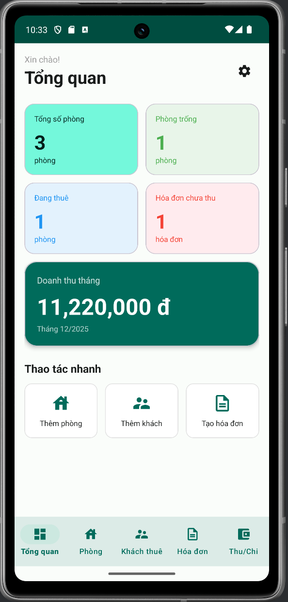
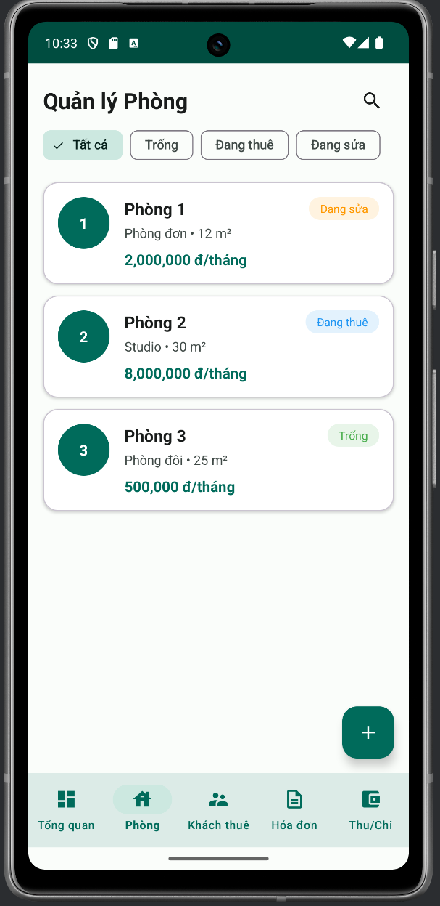
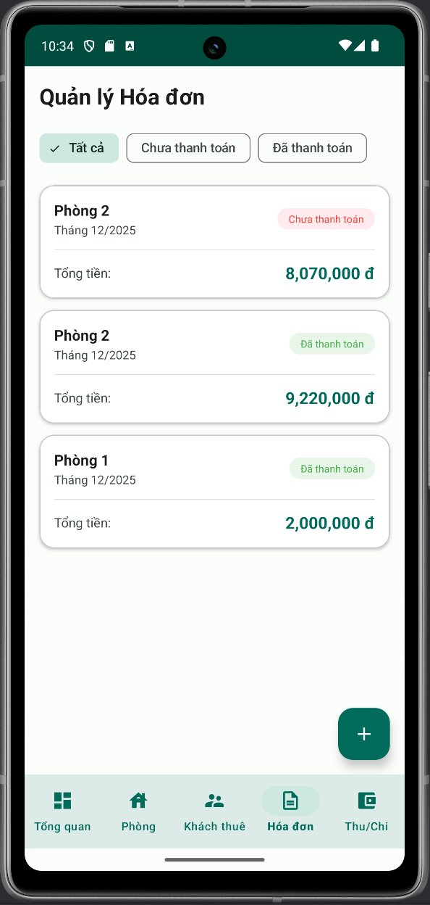
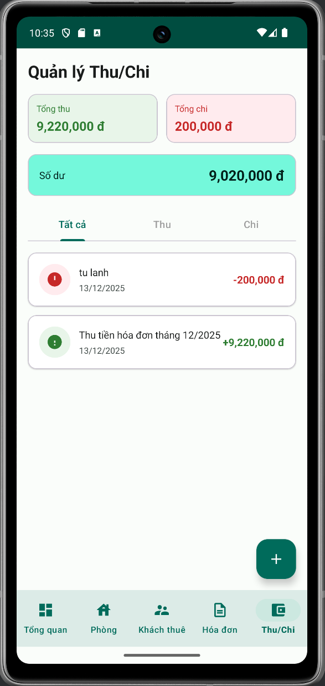

# 📱 Ứng dụng Quản lý Nhà trọ - Android

<p align="center">
  <strong>Ứng dụng Android hỗ trợ quản lý nhà trọ hiệu quả</strong>
</p>

<p align="center">
  <a href="#tính-năng">Tính năng</a> •
  <a href="#công-nghệ">Công nghệ</a> •
  <a href="#cài-đặt">Cài đặt</a> •
  <a href="#screenshots">Screenshots</a> •
  <a href="#tác-giả">Tác giả</a>
</p>

---

## 📋 Giới thiệu

**Quản lý Nhà trọ** là ứng dụng Android giúp các chủ nhà trọ quản lý hoạt động kinh doanh cho thuê phòng một cách hiệu quả và trực quan. Ứng dụng được phát triển như đồ án môn học **Lập trình trên Thiết bị Di động**.

### 🎯 Mục tiêu
- Số hóa quy trình quản lý nhà trọ truyền thống
- Tự động tính toán hóa đơn điện, nước, dịch vụ
- Theo dõi thu chi, thống kê doanh thu trực quan
- Lưu trữ dữ liệu an toàn, truy cập offline

---

## ✨ Tính năng

### 🏠 Quản lý Phòng
- Thêm, sửa, xóa thông tin phòng
- Theo dõi trạng thái: Trống / Đang thuê / Đang sửa
- Lọc phòng theo trạng thái
- Tạo mã QR chứa thông tin phòng

### 👥 Quản lý Khách thuê
- Lưu trữ thông tin khách: Họ tên, CCCD, SĐT, Email
- Gán khách vào phòng tự động cập nhật trạng thái
- Theo dõi ngày vào - ngày ra

### 📄 Quản lý Hóa đơn
- Tạo hóa đơn hàng tháng cho từng phòng
- Tự động tính: Tiền phòng + Điện + Nước + Dịch vụ
- Phí dịch vụ: Thu rác (20k), Gửi xe (50k)
- Theo dõi trạng thái: Chưa thanh toán / Đã thanh toán
- Tự động ghi nhận Thu/Chi khi thanh toán

### 💰 Quản lý Thu Chi
- Ghi nhận các khoản thu nhập và chi phí
- Phân loại theo danh mục
- Xem lịch sử giao dịch

### 📊 Thống kê Báo cáo
- Biểu đồ doanh thu theo tháng (LineChart)
- Biểu đồ tỷ lệ phòng (PieChart)
- Thẻ thống kê nhanh trên Dashboard

### 🔧 Tính năng khác
- Widget hiển thị thống kê trên Home Screen
- Chia sẻ hóa đơn qua SMS/Zalo
- Giao diện Material Design 3 hiện đại

---

## 🛠️ Công nghệ

| Thành phần | Công nghệ |
|------------|-----------|
| **Ngôn ngữ** | Java |
| **IDE** | Android Studio Hedgehog 2023.1.1 |
| **Min SDK** | API 24 (Android 7.0) |
| **Target SDK** | API 34 (Android 14) |
| **Kiến trúc** | MVVM (Model-View-ViewModel) |
| **Database** | Room Persistence Library |
| **UI** | Material Design 3 |
| **Biểu đồ** | MPAndroidChart |
| **QR Code** | ZXing Library |

---

## 📁 Cấu trúc dự án

```
app/src/main/java/com/example/quan_ly_tro/
├── adapter/              # RecyclerView Adapters
│   ├── PhongAdapter.java
│   ├── KhachThueAdapter.java
│   ├── HoaDonAdapter.java
│   └── ThuChiAdapter.java
├── data/
│   ├── database/
│   │   ├── dao/          # Data Access Objects
│   │   ├── entity/       # Room Entities
│   │   └── AppDatabase.java
│   └── repository/       # Repositories
├── ui/
│   ├── dashboard/        # Màn hình tổng quan
│   ├── phong/            # Quản lý phòng
│   ├── khachthue/        # Quản lý khách thuê
│   ├── hoadon/           # Quản lý hóa đơn
│   ├── thuchi/           # Quản lý thu chi
│   └── thongke/          # Thống kê
├── utils/                # Utility classes
├── widget/               # Home Screen Widget
└── MainActivity.java
```

---

## 📲 Cài đặt

### Yêu cầu
- Android Studio Hedgehog 2023.1.1 trở lên
- JDK 17
- Android SDK API 34
- Thiết bị Android 7.0+ hoặc Emulator

### Các bước cài đặt

1. **Clone repository**
```bash
git clone https://github.com/[YOUR_USERNAME]/quanlytro.git
```

2. **Mở dự án trong Android Studio**
```
File → Open → Chọn thư mục quanlytro
```

3. **Sync Gradle**
```
Đợi Android Studio tự động sync, hoặc nhấn "Sync Now" nếu có thông báo
```

4. **Chạy ứng dụng**
```
Run → Run 'app' (hoặc Shift + F10)
```

---

## 📸 Screenshots

<p align="center">
  
  
  
  
</p>

| Dashboard | Quản lý Phòng | Hóa đơn | Thu Chi |
|:---------:|:-------------:|:-------:|:-------:|
| Tổng quan thống kê | Danh sách phòng | Quản lý hóa đơn | Lịch sử giao dịch |

---

## 📖 Hướng dẫn sử dụng

### 1. Thêm phòng mới
- Vào tab **Phòng** → Nhấn nút **(+)**
- Nhập số phòng, giá thuê, diện tích
- Nhấn **Lưu**

### 2. Thêm khách thuê
- Vào tab **Khách thuê** → Nhấn **(+)**
- Nhập thông tin khách
- Chọn phòng → **Lưu**

### 3. Tạo hóa đơn hàng tháng
- Vào tab **Hóa đơn** → Nhấn **(+)**
- Chọn phòng, nhập số điện/nước
- Tick dịch vụ (Thu rác, Gửi xe)
- Xem tổng tiền tự động tính → **Lưu**

### 4. Thu tiền
- Click vào hóa đơn → **Thanh toán**
- Hệ thống tự động ghi nhận vào **Thu Chi**

---

## 👨‍💻 Tác giả

| | Thông tin |
|---|---|
| **Họ tên** | [Lê Hoàng Thuận] |
| **MSSV** | [2311552855] |
| **Lớp** | [23DKTPM1A] |
| **Trường** | [Nguyễn Tất Thành] |
| **Email** | [lehoangthuan4568@gmail.com] |
| **GVHD** | Thầy Lương Trường An |

---

## 📄 License

Dự án này được phát triển cho mục đích học tập.

```
Copyright © 2024 [TÊN CỦA BẠN]
Đồ án môn học: Lập trình trên Thiết bị Di động
```

---

## 🙏 Lời cảm ơn

- **Thầy Lương Trường An** - Giảng viên hướng dẫn môn Lập trình trên Thiết bị Di động
- **Google** - Android Documentation, Material Design
- **Cộng đồng mã nguồn mở** - MPAndroidChart, ZXing

---

<p align="center">
  ⭐ Nếu thấy hữu ích, hãy cho repo một star nhé! ⭐
</p>
